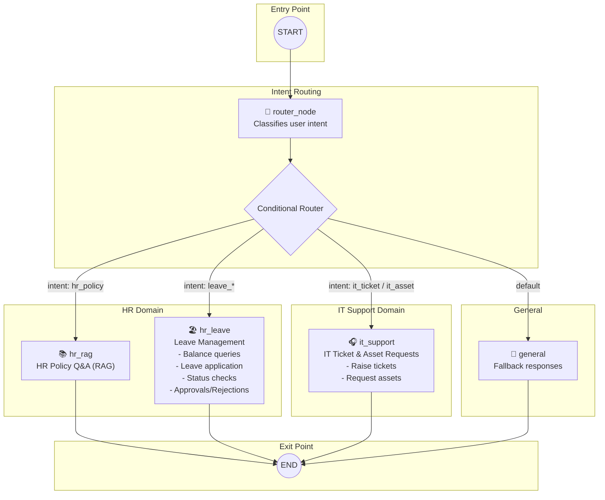

# HR-IT Copilot LangGraph Architecture

## Graph Structure



## Node Details

| Node | Function | Intents Handled |
|------|----------|-----------------|
| **router_node** | Classifies user intent using LLM | All incoming messages |
| **hr_rag** | Answers HR policy questions using RAG | `hr_policy` |
| **hr_leave** | Leave management operations | `leave_balance`, `leave_apply`, `leave_status`, `leave_list`, `leave_approve`, `leave_cancel`, `leave_statistics`, `pending_approvals` |
| **it_support** | IT ticket & asset request handling | `it_ticket`, `it_asset`, `it_ticket_update` |
| **general** | Fallback for unrecognized intents | `general` |

## Conditional Routing Logic

```python
def _route(state) -> str:
    intent = state.get("intent", "general")
    
    if intent == "hr_policy":
        return "hr_rag"
    if intent in {"leave_balance", "leave_apply", "leave_status", 
                  "leave_list", "leave_approve", "leave_cancel",
                  "leave_statistics", "pending_approvals"}:
        return "hr_leave"
    if intent in {"it_ticket", "it_asset", "it_ticket_update"}:
        return "it_support"
    return "general"
```

## Data Flow

1. **User Input** → `START`
2. **Router Node** classifies intent
3. **Conditional Edge** routes to appropriate domain node
4. **Domain Node** processes request and generates response
5. **END** returns response to user

## Key Features

- **Conversation Memory**: Uses `SqliteSaver` for persistent conversation history
- **History Trimming**: Only last 10 messages sent to LLM (full history in checkpoint)
- **Conversational Forms**: Multi-turn form filling for leave, tickets, and assets
- **Role-based Access**: Different features available based on user role (employee/manager/HR/admin)
